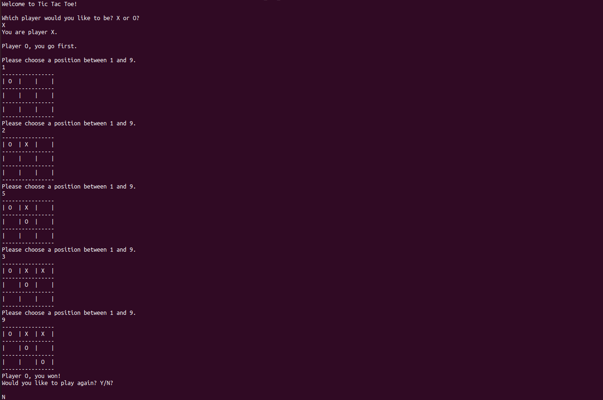

# Tic-tac-toe
This project implements the famous tic-tac-toe game and is written in Python.
The two players can choose their mark (O or X) and take turns marking the spaces in the 3x3 grid. The player who succeeds in placing three of their marks in a horizontal, vertical, or diagonal row is the winner.

## Game
Here's a screenshot that shows how the game is played
